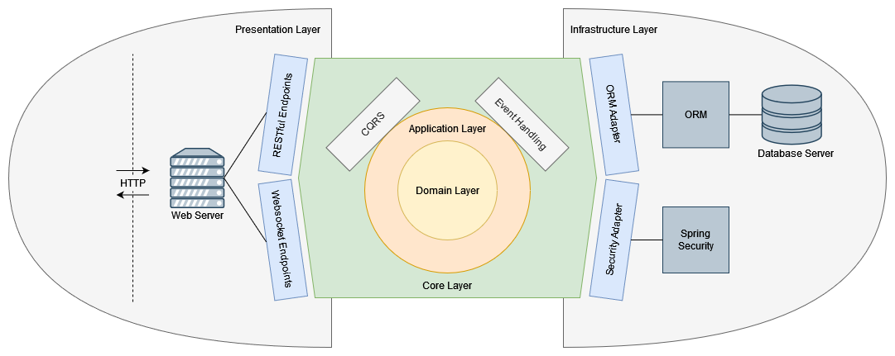
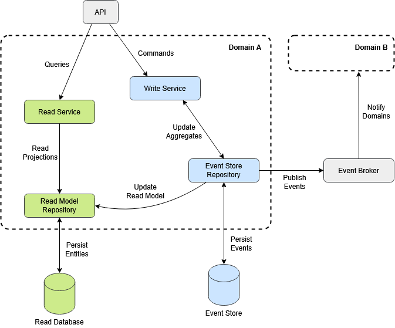

# TaskCare API

> Collaboration platform for managing tasks in a team.

## Table of contents

- [Introduction](#introduction)
- [Getting Started](#getting-started)
- [License](#license)
  - [Forbidden](#forbidden)

## Introduction

This is the backend of the TaskCare platform. TaskCare is a platform, developed from a teaching project, for managing
tasks within a team. The collaboration platform enables the joint definition of tasks to be completed and the
continuous monitoring of the processing status, transparently visible to everyone. The architecture and design of the
platform enables the user to access TaskCare from any device.

## Architecture

TaskCare API is a Kanban board application built as a highly scalable web service, providing a well-structured and
efficient RESTful interface for seamless interaction. The application architecture is based on the principles of
Hexagonal Architecture, also known as Ports and Adapters, ensuring a clear separation of concerns and promoting
flexibility in system design. Additionally, it incorporates concepts from Domain-Driven Design (DDD) to maintain
a strong alignment between the application's structure and its business logic. The infrastructure layer is designed
to leverage several third-party services to optimize data storage, caching, and file management. MySQL serves as
the primary database, responsible for persisting all application-related data, including both event-sourced and
read-model information. Redis is utilized as an in-memory data store, significantly improving performance by
caching frequently accessed data and reducing latency in data retrieval. MinIO acts as an object storage solution,
managing file attachments, binary data, and user-uploaded content efficiently, ensuring scalable and reliable
handling of media files.

  

The system employs Event Sourcing for the write model, where all changes to the application state are stored as
discrete events. This approach ensures a complete history of all modifications, allowing the system state to be
reconstructed at any point in time. For the read model, a traditional CRUD (Create, Read, Update, Delete) approach
is used, enabling direct and efficient data retrieval, modification, and management within a structured database.
This combination ensures a robust and efficient data flow by leveraging the immutability of event logs while
maintaining fast and straightforward access to data. Additionally, the system follows the CQRS (Command Query
Responsibility Segregation) pattern, where the Query (Read) Service and Command (Write) Service are strictly
separated. This separation enhances scalability by optimizing query processing and command execution independently
for each domain. MySQL serves a dual purpose in this architecture: it acts as the event store for the write model,
persistently logging all domain events, while simultaneously functioning as the relational database for the read
model, storing structured and query-optimized data.

  

## Getting Started

TaskCare is generally operated on-premise. There are a few steps to follow for installation: Firstly, the
appropriate system environment with its third-party services must be set up (See [Operation](docs/operation.md))
and secondly, the application must be correctly configured (See [Configuration](docs/configuration.md)). After that,
TaskCare can then be started and operated on-premise, optionally scaled horizontally.

## License

Copyright (c) 2024 Constantin Müller

Permission is hereby granted, free of charge, to any person obtaining a copy
of this software and associated documentation files (the "Software"), to deal
in the Software without restriction, including without limitation the rights
to use, copy, modify, merge, publish, distribute, sublicense, and/or sell
copies of the Software, and to permit persons to whom the Software is
furnished to do so, subject to the following conditions:

The above copyright notice and this permission notice shall be included in all
copies or substantial portions of the Software.

THE SOFTWARE IS PROVIDED "AS IS", WITHOUT WARRANTY OF ANY KIND, EXPRESS OR
IMPLIED, INCLUDING BUT NOT LIMITED TO THE WARRANTIES OF MERCHANTABILITY,
FITNESS FOR A PARTICULAR PURPOSE AND NONINFRINGEMENT. IN NO EVENT SHALL THE
AUTHORS OR COPYRIGHT HOLDERS BE LIABLE FOR ANY CLAIM, DAMAGES OR OTHER
LIABILITY, WHETHER IN AN ACTION OF CONTRACT, TORT OR OTHERWISE, ARISING FROM,
OUT OF OR IN CONNECTION WITH THE SOFTWARE OR THE USE OR OTHER DEALINGS IN THE
SOFTWARE.

[MIT License](https://opensource.org/licenses/MIT) or [LICENSE](LICENSE) for
more details.

### Forbidden

**Hold Liable**: Software is provided without warranty and the software
author/license owner cannot be held liable for damages.
